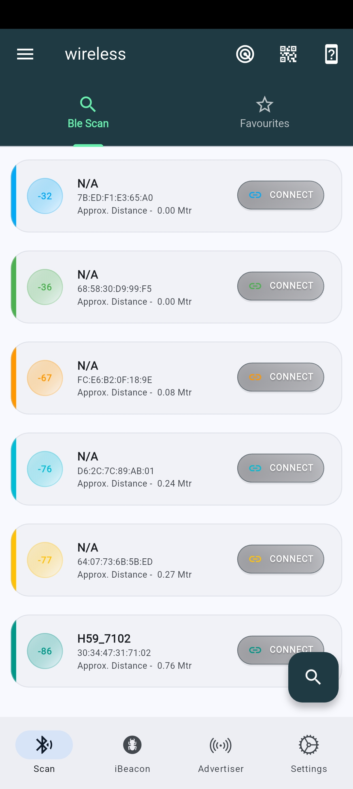
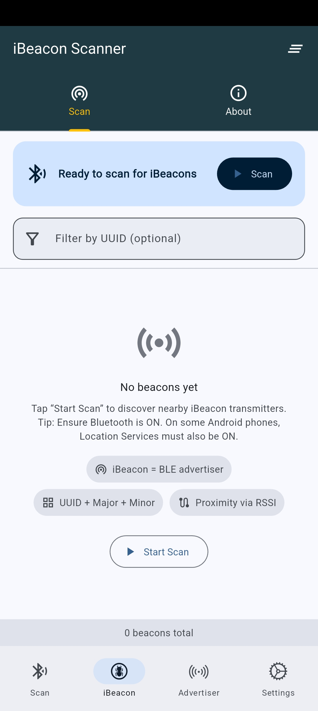
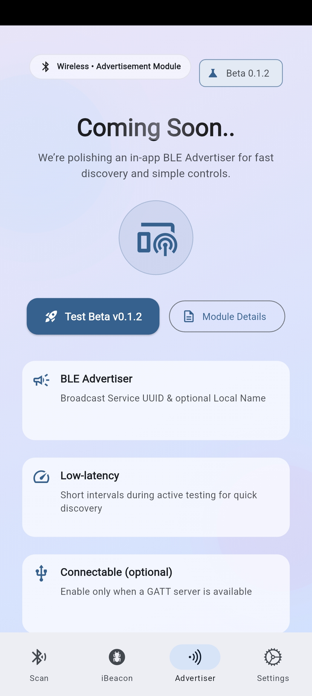
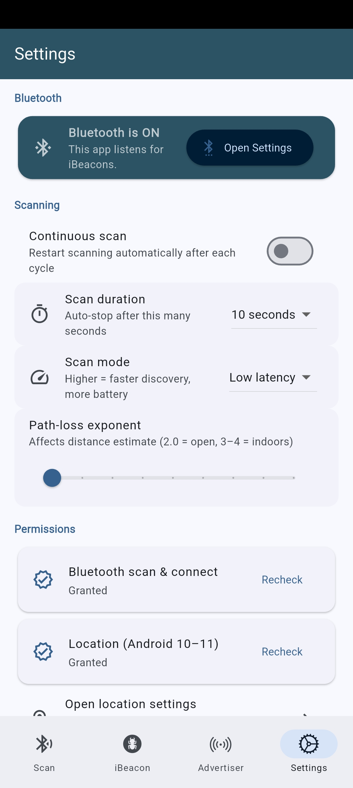
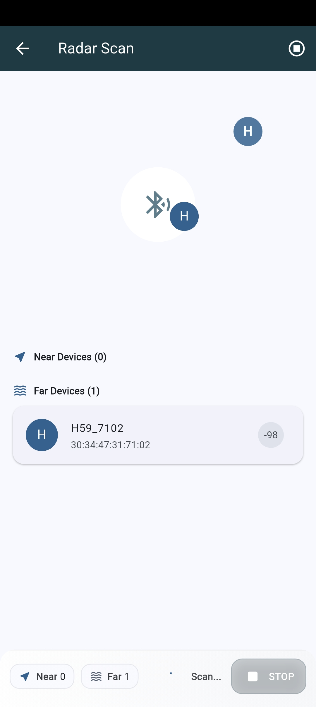
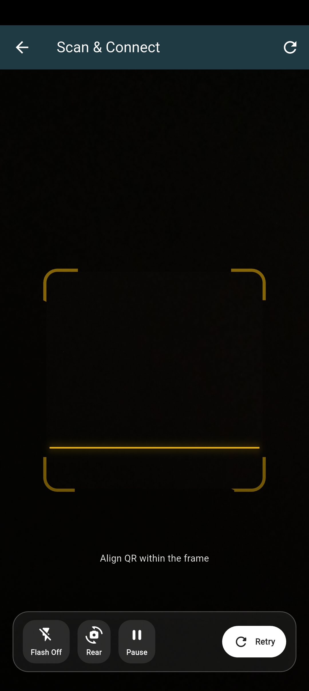

# 📡 wireless — BLE Workbench

**wireless** is an all-in-one Bluetooth Low Energy (BLE) toolkit for developers, QA engineers, and hardware teams.  
It brings scanning, advertising, iBeacon, and GATT server tools together in a sleek, dark UI — so you can prototype and debug faster.

---
## 🌐 Web - https://wireless.fittech.in/

## ✨ Features

- 🔍 **BLE Scanner** — discover nearby devices with live RSSI, filters, and manufacturer data parsing.  
- 🛰️ **iBeacon Scanner** — decode UUID/Major/Minor, normalize TX power, and estimate distance.  
- 📡 **Advertiser** — broadcast custom payloads (iBeacon, Eddystone, Manufacturer Data).  
- 🧱 **GATT Server** — compose services & characteristics visually or via JSON, then host locally.  
- ⚡ **Reads/Writes & Subscriptions** — interact with characteristics in real time.  
- 🧭 **Filtering & Targeting** — filter by name, service UUID, manufacturer, connectable state, RSSI thresholds.  
- 🧪 **QA Tools** — session logging, export, and quick presets for repeatable testing.  

---

##  📁 Documentation for wireless

- 🌐 **Documentation url - https://wireless.fittech.in/docs.html

## 🚀 Platforms

- iOS  
- Android  
- Desktop (coming soon)  

---

## 📸 Screenshots

| BLE Scan | iBeacon | Advertiser |
|----------|---------|------------|
|  |  |  |

| Settings | Radar Scan | QR Connect |
|----------|------------|------------|
|  |  |  |

---

## 📦 Installation

Download from the respective app store (links coming soon):  
- [App Store](#)  
- [Google Play](#)  
- [Desktop Builds](#) _(coming soon)_  

---

## 🛠️ Development

This repo contains the source for **wireless**.  
Clone and install dependencies:

```bash
git clone https://github.com/yourusername/wireless.git
cd wireless
# Install dependencies
pub get
#Face any issue run
flutter doctor
=======
# wireless

Project to communicate with wireless protocol devices

## Getting Started

This project is a starting point for a Flutter application.

A few resources to get you started if this is your first Flutter project:

- [Lab: Write your first Flutter app](https://docs.flutter.dev/get-started/codelab)
- [Cookbook: Useful Flutter samples](https://docs.flutter.dev/cookbook)

For help getting started with Flutter development, view the
[online documentation](https://docs.flutter.dev/), which offers tutorials,
samples, guidance on mobile development, and a full API reference.
>>>>>>> 234a0ce (E:Initial Commit)
